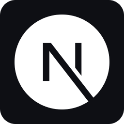
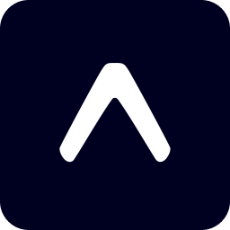
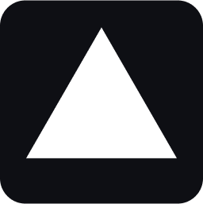
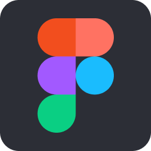
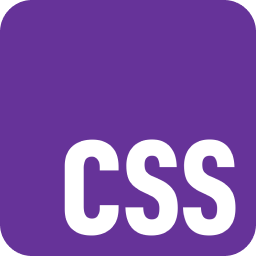
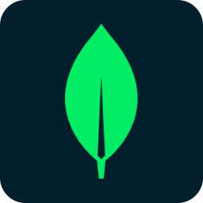
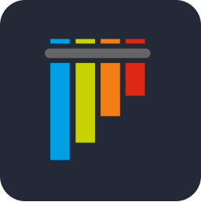
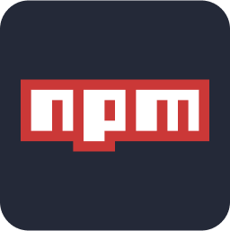

# Hi there 👋

I'm a **Full-Stack Web Developer** from Brooklyn, NY that's also building **React Native apps on Android**.

🌐[My Portfolio Site](https://www.cyanchill.com/)

## 🔭 I'm currently working on ...

- React Native content on [MissingCore](https://github.com/MissingCore) such as:
  - [Music](https://github.com/MissingCore/Music): A Nothing inspired music player.
  - [@missingcore/audio-metadata](https://github.com/MissingCore/audio-metadata): A package for getting metadata from audio files in React Native and Node.js.
- [Caerula](https://github.com/cyanChill/Caerula): A fun little website for viewing information about Arknights.

## 🛠️ I'm currently build apps with ...

### I've also use ...

<!--
## 📊 My Github Stats

  
    
  
  
    
  
   
  <b>Note:</b> Top languages is only a metric of the languages my public code consists of and doesn't reflect experience or skill level.

-->
