# Hi there 👋

I'm a Frontend-focused Full Stack Engineer specializing in building web & mobile applications with React, React Native, and TypeScript.

🌐[My Portfolio Site](https://www.cyanchill.com/)

## 🔭 I'm currently working on ...

- React Native content on [MissingCore](https://github.com/MissingCore) such as:
  - [Music](https://github.com/MissingCore/Music): A Nothing inspired music player.
  - [@missingcore/react-native-metadata-retriever](https://github.com/MissingCore/react-native-metadata-retriever): A successor to [`@missingcore/audio-metadata`](https://github.com/MissingCore/audio-metadata) which utilizes Android's built-in metadata reader for better performance.
  - And [assorted performant React Native components](https://github.com/MissingCore/Music/tree/dev/mobile/modules/ui) that you can copy & paste into your projects.

## 🛠️ I'm currently building apps with ...

[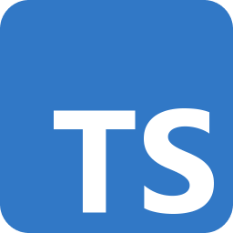](https://www.typescriptlang.org/)
[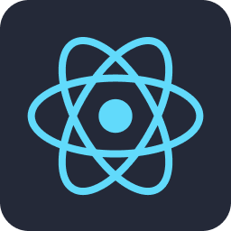](https://react.dev/)
[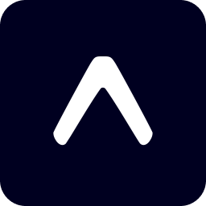](https://expo.dev/)
[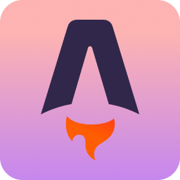](https://astro.build/)

[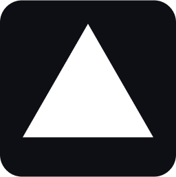](https://vercel.com/)
[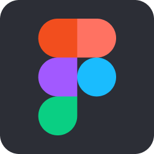](https://figma.com/)
[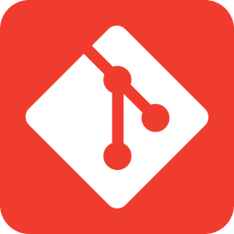](https://git-scm.com/)

### I've also used ...

[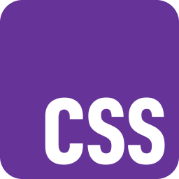](https://developer.mozilla.org/en-US/docs/Web/CSS)
[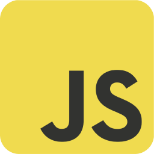](https://developer.mozilla.org/en-US/docs/Web/JavaScript)
[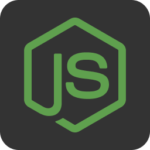](https://nodejs.org/)
[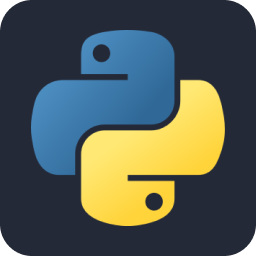](https://www.python.org/)
[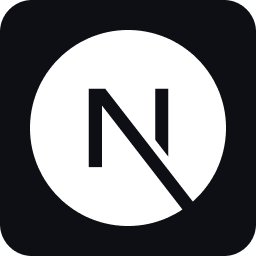](https://nextjs.org/)

[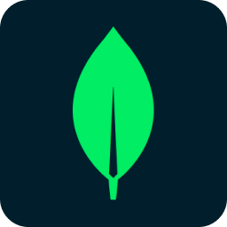](https://www.mongodb.com/)

[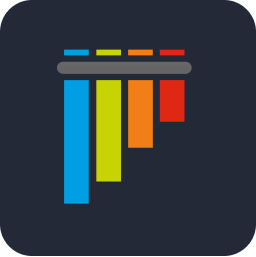](https://docs.pytest.org/)
[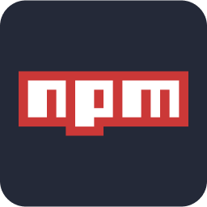](https://www.npmjs.com/)

<!--
## 📊 My Github Stats

  
    
  
  
    
  
   
  <b>Note:</b> Top languages is only a metric of the languages my public code consists of and doesn't reflect experience or skill level.

-->
