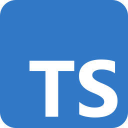
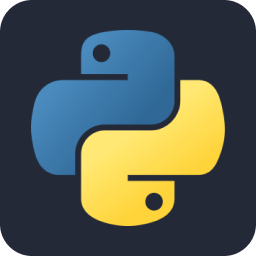

# Hi there 👋

I'm a Software Engineer that started off learning **Full-Stack Web Development**, followed by a bit of **Mobile Development** with **React Native**, and am currently learning **Data Science**.

🌐[My Portfolio Site](https://www.cyanchill.com/)

## 🔭 I'm currently working on ...

- React Native content on [MissingCore](https://github.com/MissingCore) such as:
  - [Music](https://github.com/MissingCore/Music): A Nothing inspired music player.
  - [@missingcore/react-native-metadata-retriever](https://github.com/MissingCore/react-native-metadata-retriever): A successor to `@missingcore/audio-metadata` which utilizes Android's built-in metadata reader for better performance. Built with around a week of Kotlin knowledge learnt on the go.
  - [@missingcore/audio-metadata](https://github.com/MissingCore/audio-metadata): A TypeScript package for getting metadata from audio files in React Native and Node.js through reading the bytes in the file.
- [Caerula](https://github.com/cyanChill/Caerula): A fun little website for viewing information about Arknights.

## 🛠️ I'm currently building apps with ...

### I've also used ...

<!--
## 📊 My Github Stats

  
    
  
  
    
  
   
  <b>Note:</b> Top languages is only a metric of the languages my public code consists of and doesn't reflect experience or skill level.

-->
